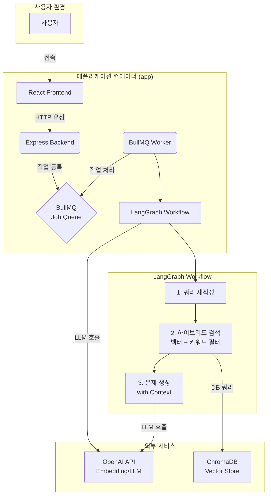
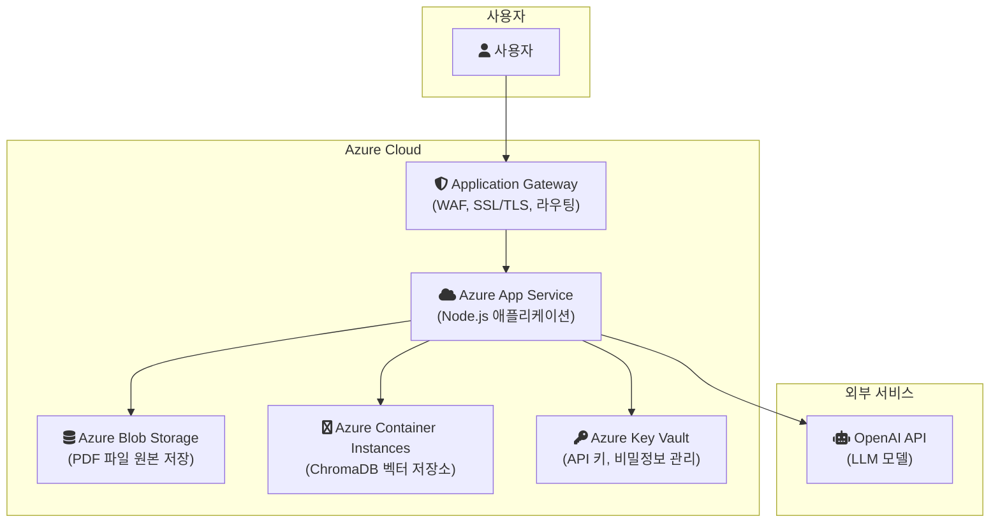

# LLM 기반 교육용 대화 및 문제 생성 시스템

## 1. 프로젝트 개요

본 프로젝트는 LangGraph 프레임워크를 기반으로 구축된 RAG(Retrieval-Augmented Generation) 시스템입니다. PDF 문서를 업로드하거나, 특정 교과과정(과목, 학년, 단원, 차시)과 키워드를 지정하여 관련성 높은 교육용 문제(객관식, 주관식 등)를 동적으로 생성하는 것을 목표로 합니다.

## 2. 기술 스택

- **Frontend:** React, TypeScript
- **Backend:** Node.js, Express, TypeScript
- **LLM Orchestration:** LangChain.js, LangGraph
- **Vector Database:** ChromaDB
- **Background Jobs:** BullMQ, Redis
- **Containerization:** Docker, Docker Compose

## 3. 시스템 아키텍처



## 4. 설치 및 실행 방법

### 사전 요구 사항
- [Docker](https://www.docker.com/get-started) 및 [Docker Compose](https://docs.docker.com/compose/install/)가 설치되어 있어야 합니다.
- [Node.js](https://nodejs.org/) (v20 이상 권장) 및 [npm](https://www.npmjs.com/)이 설치되어 있어야 합니다.

### 단계별 실행 가이드

1.  **Git 저장소 복제:**
    ```bash
    git clone <repository-url>
    cd <repository-name>
    ```

2.  **환경 변수 파일 생성:**
    - 프로젝트 루트 디렉터리에 있는 `.env.example` 파일을 복사하여 `.env` 파일을 생성합니다.
    - (Windows Command Prompt)
      ```
      copy .env.example .env
      ```
    - (Windows PowerShell, Linux, macOS)
      ```
      cp .env.example .env
      ```

3.  **환경 변수 설정:**
    - 생성된 `.env` 파일을 열고, `OPENAI_API_KEY`에 본인의 유효한 OpenAI API 키를 입력합니다.
      ```env
      OPENAI_API_KEY="sk-xxxxxxxxxxxxxxxxxxxxxxxxxxxxxx"
      ```

4.  **의존성 설치:**
    ```bash
    npm install
    ```

5.  **애플리케이션 실행 (Docker Compose 사용):**
    - Docker Desktop이 실행 중인지 확인하세요.
    - 아래 명령어를 실행하여 모든 서비스를 빌드하고 백그라운드에서 실행합니다.
    ```bash
    docker-compose up -d --build
    ```

6.  **애플리케이션 접속:**
    - 빌드가 완료되면 웹 브라우저에서 `http://localhost:3000` 주소로 접속합니다.

## 5. 주요 기능

- **문제 생성:** PDF 문서를 업로드하거나, 교과, 학년, 단원, 차시, 키워드 등 상세 메타데이터를 입력하여 맞춤형 문제를 생성합니다.
- **하이브리드 검색:** 사용자가 입력한 메타데이터와 키워드를 활용하여 벡터 검색(의미 기반)과 키워드 필터링을 결합한 하이브리드 검색을 수행하여 정확도를 높입니다.
- **비동기 작업 처리:** BullMQ를 사용하여 무거운 문서 처리 및 문제 생성 작업을 백그라운드에서 안정적으로 처리합니다.

## 6. 인수인계 참고사항

- 모든 주요 로직은 `src` 폴더에 TypeScript로 작성되어 있습니다.
- 백엔드 API 라우팅은 `src/api/routes.ts` 파일에서 관리됩니다.
- 핵심 RAG 파이프라인은 `src/workflows/questionWorkflow.ts`에 LangGraph로 구현되어 있습니다.
- 데이터베이스 관련 로직은 `src/modules/vectorStoreManager.ts`에 정의되어 있습니다.
- 백그라운드 작업 처리 로직은 `src/modules/jobQueue.ts`에서 확인할 수 있습니다.

### **프로젝트 개요 (Project Overview)**

본 프로젝트는 PDF 파일을 기반으로 완성도 높은 문제 세트(문제, 힌트, 해설, 답)를 자동으로 생성하는 R&D 프로젝트입니다. 초기에는 백엔드 협업을 통한 서비스 배포를 목표로 했으나, 신속한 프로토타이핑과 아이디어 검증을 위해 담당자가 단독으로 사용 가능한 애플리케이션 형태로 개발 방향을 전환했습니다.

핵심 목표는 PDF 텍스트 파싱, 메타데이터 기반의 벡터 DB 검색, 그리고 이를 통한 LLM 기반의 문제 생성 자동화입니다.

### **주요 기능 (Core Features)**

*   **PDF 업로드 및 자동 파싱**: 사용자가 교육 자료(PDF)를 업로드하면 시스템이 텍스트를 자동으로 추출하고 처리합니다.
*   **간편한 메타데이터 설정**: 사용자는 추출된 텍스트에 교과, 학년, 단원 등 핵심 메타데이터를 수동으로 간단히 태깅할 수 있습니다.
*   **하이브리드 검색**: 키워드 검색과 벡터 검색을 결합한 하이브리드 검색을 통해 문서의 핵심 내용과 의미적 맥락을 모두 고려하여 관련성이 높은 부분을 정확히 찾아냅니다.
*   **자동 문제 생성**: 검색된 내용을 기반으로 LLM이 완성된 형태의 문제 세트(문제, 힌트, 해설, 답)를 생성합니다.

### **기술적 과제와 해결 과정 (Challenges & Solutions)**

개발 초기, R&D 성격상 데이터 전처리를 최소화하고 키워드 위주로 검색을 수행한 결과, 특정 키워드에 편중된 문제만 생성되는 한계점을 발견했습니다.

이를 해결하기 위해 **키워드 검색의 정확성**과 **벡터 검색의 의미적 풍부함**을 결합하는 **하이브리드 검색(Hybrid Search)** 방식을 도입했습니다. 또한, 각 검색 방식의 가중치를 동적으로 조정하는 로직을 추가하여 검색 품질을 고도화함으로써, 사용자가 의도한 내용과 깊이 있는 맥락을 반영한 문제 생성이 가능하도록 개선했습니다.

### **주요 성과 및 교훈 (Key Outcomes & Lessons Learned)**

*   **시장 가치 검증**: 기획 담당자와의 피드백을 통해, 현재 교육 시장의 요구와 '**국정 교과서 개정**'이라는 변수를 고려할 때, 본 프로젝트는 R&D로서의 가치가 더 높다는 결론을 얻었습니다. 이를 통해 프로젝트의 방향성을 '서비스 즉시 적용'에서 '기술 연구 및 고도화'로 명확히 재설정했습니다.
*   **프롬프트 엔지니어링의 중요성**: LLM의 응답 품질을 높이기 위해서는 문제, 힌트, 해설, 답 등 각 요소에 맞는 최적화된 프롬프트가 필수적임을 확인했습니다. 데이터 소스 기반의 고품질 문제 생성을 위해서는 정교한 프롬프트 설계가 선행되어야 합니다.
*   **기술적 성장**: 하이브리드 검색 도입과 검색 알고리즘 고도화를 통해, 복잡한 사용자 요구사항을 만족시키는 검색 시스템 설계 역량을 확보했습니다.

---

### **클라우드 배포 아키텍처 (Azure)**

본 애플리케이션을 안정적으로 운영하기 위해, Microsoft Azure 클라우드 기반의 아키텍처를 제안합니다. 이 아키텍처는 확장성, 보안, 데이터 영속성을 고려하여 설계되었습니다.

#### **아키텍처 구성도**



#### **컴포넌트별 역할 및 배포 전략**

1.  **Azure App Service (애플리케이션 서버)**
    *   **역할**: Node.js 기반의 백엔드 애플리케이션을 호스팅합니다.
    *   **배포**: GitHub Actions와 같은 CI/CD 파이프라인을 연동하여, `main` 브랜치에 코드가 푸시될 때마다 자동으로 빌드 및 배포되도록 구성합니다.
    *   **설정**: `NODE_ENV`를 `production`으로 설정하고, 필요한 모든 환경 변수(DB 정보, API 키 등)는 Key Vault 참조를 사용해 안전하게 주입합니다.

2.  **Azure Blob Storage (PDF 파일 저장소)**
    *   **역할**: 사용자가 업로드하는 모든 PDF 원본 파일을 영구적으로 저장합니다.
    *   **연동**: App Service는 SDK 또는 REST API를 통해 Blob Storage에 파일을 업로드하고 관리합니다. 파일 접근에는 SAS(Shared Access Signature) 토큰을 사용하여 보안을 강화합니다.

3.  **Azure Container Instances (ChromaDB 서버)**
    *   **역할**: 벡터 데이터베이스인 ChromaDB를 Docker 컨테이너로 실행합니다.
    *   **배포**: `chromadb/chroma` Docker 이미지를 사용하여 컨테이너 인스턴스를 생성합니다. 데이터의 영속성을 보장하기 위해, Azure Files와 같은 외부 스토리지 볼륨을 마운트하여 DB 데이터를 저장해야 합니다.
    *   **네트워킹**: App Service에서만 접근할 수 있도록 가상 네트워크(VNet) 내에 배포하거나, Private Endpoint를 구성하여 외부 노출을 최소화합니다.

4.  **Application Gateway (웹 방화벽 및 로드 밸런서)**
    *   **역할**: 웹 트래픽의 진입점 역할을 하며, WAF(Web Application Firewall)를 통해 SQL Injection, XSS 등 일반적인 웹 공격을 방어합니다.
    *   **기능**: SSL/TLS 인증서 관리를 통해 HTTPS 통신을 강제하고, 수신되는 요청을 App Service로 안전하게 전달(라우팅)합니다.

5.  **Azure Key Vault (비밀정보 관리)**
    *   **역할**: `OPENAI_API_KEY`와 같은 중요한 API 키, 데이터베이스 연결 문자열 등 모든 민감 정보를 안전하게 저장하고 관리합니다.
    *   **보안**: App Service에 관리 ID(Managed Identity)를 부여하고, 이 ID가 Key Vault에 접근할 수 있도록 권한을 설정합니다. 이를 통해 코드나 환경 변수에 비밀 키를 직접 하드코딩하는 위험을 방지합니다.

#### **배포 및 운영 시나리오**

1.  **초기 배포**: 각 Azure 리소스를 IaC(Infrastructure as Code) 도구인 Terraform 또는 Bicep을 사용해 코드로 정의하고 배포합니다.
2.  **PDF 업로드**: 사용자가 PDF를 업로드하면, App Service는 해당 파일을 Azure Blob Storage에 저장하고 파일의 경로 또는 ID를 메타데이터와 함께 ChromaDB에 벡터로 변환하여 저장합니다.
3.  **문제 생성**: 사용자가 문제 생성을 요청하면, App Service는 Azure Key Vault에서 OpenAI API 키를 가져와 LLM 모델을 호출하고, 생성된 결과를 사용자에게 반환합니다.

#### .env 파일 예시

# Application Settings
PORT=3000
NODE_ENV=development
VECTOR_STORE_DIR=./src/data/vector_store
CHROMA_COLLECTION_NAME=education_content
OPENAI_API_KEY=...

# ChromaDB 설정
CHROMA_SERVER_HOST=localhost
CHROMA_SERVER_PORT=8000
CHROMA_SERVER_URL=http://localhost:8000
CHROMA_DB_PATH=./chroma_db

CHROMA_EXTERNAL_SERVER=True

#### docker 실행
docker-compose up -d --build

---

## 7. 연락처 및 지원

**프로젝트 담당자**: gorsjsla8459@dnsoft.co.kr

문의사항이나 기술 지원이 필요한 경우 위 이메일로 연락해 주세요.